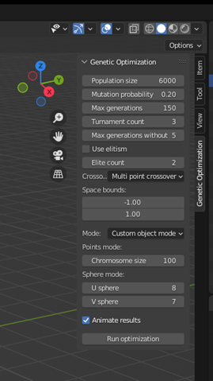
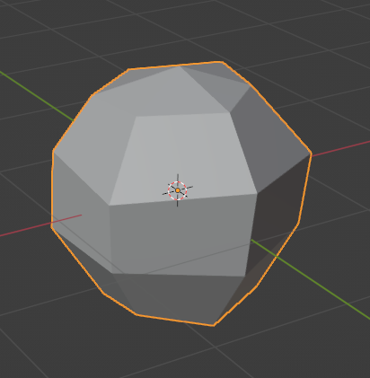
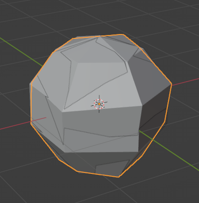
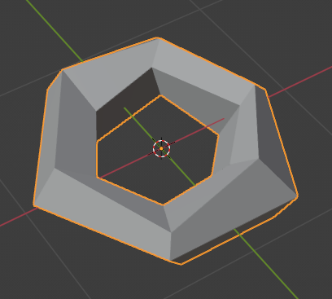
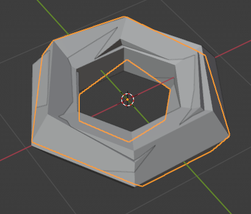
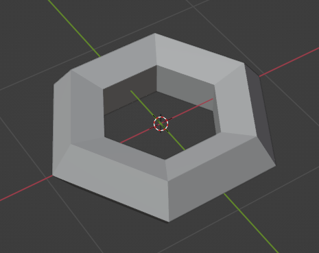
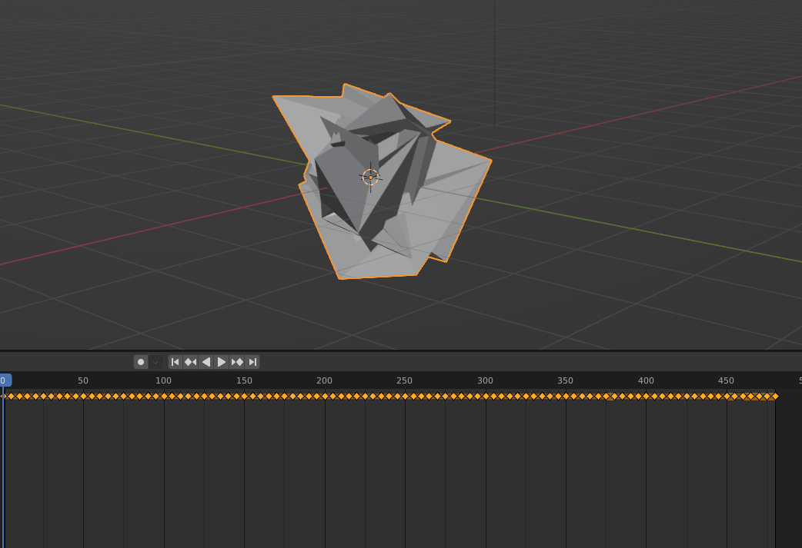

# BlenderGeneticAlgorithm

[Blender](https://www.blender.org/) add-on and script with genetic optimization algorithm used to optimize random points set to match the selected target shape or independent optimization criterium with additional animation of subsequent results.

In the algorithm, each solution is represented as a separate point set (individual) where each 3D point is treated as a gene and all points create a chromosome. Initially, all points are randomly generated in the volume bounded by parameters (default 1,-1) on each axis. All point sets create a population with a size specified by a parameter.
The following components were implemented in the algorithm:
- three crossover approaches:
    - uniform crossover,
    - one-point crossover,
    - multi-point crossover,
- mutation by swapping two genes in the chromosome with a given probability,
- elitism by adding the selected number of best-fitted individuals and a mutated version of the best one to the next generation,
- tournament selection of two parents for each new offspring.

In the optimization, each point set from the population has a number of points equal to the number of vertices of the target model. Topology is inherited from the model as well connecting points from the chromosome accordingly to the model’s edges. Each point has to be as close as possible to its counterpart from the target model.

The algorithm can return a lot of different solutions which are similar to the target model. This can be useful for:
- the creation of a rich variation of 3D models based on some basic shapes,
- the creation of imperfections in the given model,
- generation of shapes that can be used to displace the models while keeping their base shape.

Additionally, animation of best solutions in subsequent generations shows how such an algorithm processes 3D data and how it converges to the final result. This in turn can be useful in:
- presenting the evolution of some shape from the random noise to its final form,
- the destruction of the shape,
- the morphing between two shapes.

## Requirements
- [Blender 3.3](https://www.blender.org/)
## Installation
- Open Blender.
- Go to Edit->Preferences->Add-ons and select Install in the top right corner.
- Select GeneticCreationAddOn.py file from the disk and click Install Add-on.
- Enable add-on by clicking on the box next to its name, the add-on name is ‘Genetic Optimizer’.
- Add-on should be visible in the N-Panel

## Usage
To use this add-on set desired parameters values and click ‘Run optimization’
There are three modes available in this add-on:
- Points mode – in this mode raw points without topology will be optimized to be as far from the center of the coordinate system as possible. There is an additional parameter for this mode ‘Chromosome size’ determining the number of points to optimize.
- Sphere mode – in this mode sphere shape will be created automatically in the addon using the additional parameters ‘U sphere’ and ‘V sphere’ determining the size of the divisions of the sphere.
- Custom object mode – in this mode an optimization target will be set as the currently selected model from the scene.

## Notes
Additional information regarding optimization progress could be seen after clicking Window->Toggle System Console.
## Results

Optimization result for the sphere with chromosome size 26 after 75 generations (algorithm output, algorithm output and reference):

| Algorithm output  | Algorithm output and reference |
| ------------- | ------------- |
|  |  |

Optimization result for the torus with chromosome size of 30 after 48 generations (algorithm output, algorithm output and reference, reference):

| Algorithm output  | Algorithm output and reference | Reference |
| ------------- | ------------- | ------------- |
|  |  |  |

Learning process:

